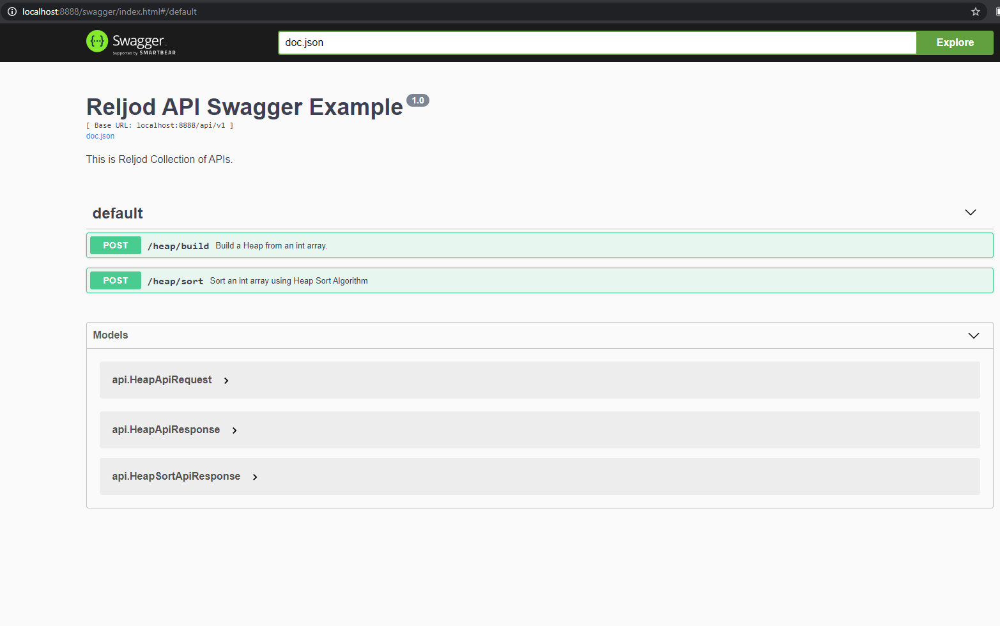

# Reljod's Repository


API Backend for my own personal Portfolio written in Golang.


## Sections
- [Reljod's Repository](#reljods-repository)
  - [Sections](#sections)
  - [Rest API](#rest-api)
  - [Data Structures and Algorithms](#data-structures-and-algorithms)
  - [Design Patterns](#design-patterns)
  - [Local Development](#local-development)
  - [Testing](#testing)
  - [Benchmark](#benchmark)
  - [Contacts](#contacts)


## Rest API
In local, you can found the Swagger examples at http://localhost:8888/swagger/index.html


## Data Structures and Algorithms
The code can be found under the folder ```./app/algo/...```
- Data Structures Implemented so far:
  - List
  - Tuple
  - Heap

- Algorithms Implemented so far:
  - Heap build and Heap sort.

## Design Patterns
The code can be found under the folder ```./app/designpattern/...```
- Design Patterns implemented so far:
  - Adapter Design Pattern

## Local Development
1. Git Clone the repo.
2. Install Go from the official Golang install link [here](https://golang.org/doc/install)
3. Under the root folder, run ```go mod tidy```
4. Run
   1. To run the Rest API, run the ```main.go``` under the root folder. Then access the swagger under http://localhost:8888.
        ```
            Example:
            go run main.go
        ```
   2. To execute the algorithms, design pattern examples, run the code under exec/...
        ```
            Example:
            go run exec/<folder>/<filename.go>
        ```
5. (Optional) Configure Environmental Variables to change the api behavior. The environmental behaviors can be found in ```config.env```. As of now, PORT and logging level can be set by config.env.

## Testing
- Simply run ```go test -v ./...``` to test all available tests in the Repo.


## Benchmark
- Simply run ```go test -v -benchmem -bench "." "./..."``` to test all available benchmark tests in the Repo.

## Contacts
- To know more, please message me at my [LinkedIn Account](https://www.linkedin.com/in/reljodoreta/).
- Or email me at ```oretareljod@gmail.com```