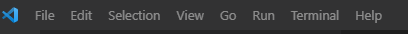
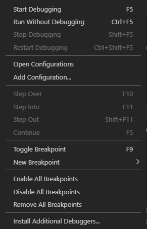

# Reljod's Repository


API Backend for my own personal Portfolio written in Golang.


## Sections
- [Reljod's Repository](#reljods-repository)
  - [Sections](#sections)
  - [Rest API](#rest-api)
  - [Data Structures and Algorithms](#data-structures-and-algorithms)
  - [Design Patterns](#design-patterns)
  - [Best Practices](#best-practices)
  - [Local Development](#local-development)
  - [Testing](#testing)
  - [Benchmark](#benchmark)
  - [VSCode Guide](#vscode-guide)
  - [Contacts](#contacts)


## Rest API
In local, you can find the Swagger examples at http://localhost:8888/swagger/index.html

Endpoints as of now:
1. Personal Info Endpoints.
2. Heap Endpoints.

## Data Structures and Algorithms
The code can be found under the folder ```./app/algo/...```
- Data Structures Implemented so far:
  - List
  - Tuple
  - Heap

- Algorithms Implemented so far:
  - Heap build and Heap sort.

## Design Patterns
The code can be found under the folder ```./app/designpattern/...```
- Design Patterns implemented so far:
  - Adapter Design Pattern

## Best Practices
- [Go Best Practices](./exec/bestpractice/README.md)

## Local Development
1. Git Clone the repo.
2. Install Go from the official Golang install link [here](https://golang.org/doc/install)
3. Under the root folder, run ```go mod tidy```
4. Run
   1. To run the Rest API, run the ```main.go``` under the root folder. Then access the swagger under http://localhost:8888.
        ```
            Example:
            go run main.go
        ```
   2. To execute the algorithms, design pattern examples, run the code under exec/...
        ```
            Example:
            go run exec/<folder>/<filename.go>
        ```
5. (Important) Configure Environmental Variables to change the api behavior. The environmental behaviors can be found in ```config.env```. As of now, PORT and logging level can be set by config.env.
    - (Important) Set DATABASE_URL to MongoDB URL as currently, the application uses MongoDB as its NoSQL Database.

## Testing
- Simply run ```go test -v ./...``` to test all available tests in the Repo.


## Benchmark
- Simply run ```go test -v -benchmem -bench "." "./..."``` to test all available benchmark tests in the Repo.


## VSCode Guide
If we're using VSSCode in our development, follow the instructions below to easily execute Go script or run the local server.
1. At the top section, click `Run` then `Add configurations`. <br>

2. Click the `Add configuration`. This should add the `launch.json` file under `.vscode` folder.<br>

3. Edit the `launch.json file` and use the configuration below:
```json
{
    // Use IntelliSense to learn about possible attributes.
    // Hover to view descriptions of existing attributes.
    // For more information, visit: https://go.microsoft.com/fwlink/?linkid=830387
    "version": "0.2.0",
    "configurations": [
        {
            "name": "Connect to server",
            "type": "go",
            "request": "attach",
            "mode": "remote",
            "remotePath": "${workspaceFolder}",
            "port": 8888,
            "host": "127.0.0.1",
        },
        {
            "name": "Launch Package",
            "type": "go",
            "request": "launch",
            "mode": "auto",
            "program": "${fileDirname}",
            "env": {
                "DATABASE_URL": "<database_url>" // ask this to the owner.
            }
        }
    ]
}
```
4. To run the script, just open the file that you want to run and click `ctrl + F5` or Run without Debugging.

## Contacts
- To know more, please message me at my [LinkedIn Account](https://www.linkedin.com/in/reljodoreta/).
- Or email me at ```oretareljod@gmail.com```